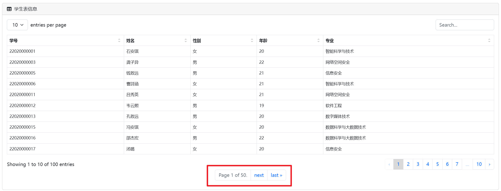
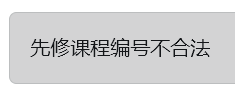

## 一、项目概述

### **项目名称**

Student Infomation Manage System

github仓库：[Student Infomation Manage System]()

### **项目目标**

 实现一个管理信息系统，完成教务系统数据库中数据表的设计，使用MySQL实现所设计的数据库，实现数据存储、查询、更新、删除等，并基于所设计的数据库实现一个“学生教务管理系统”

### 技术栈

+ 编程语言：python3.10
+ web框架：django4.2.7
+ 数据库：mysql8.3.5

### 项目结构

```
├─.idea
├─manageSystem
│  ├─migrations
│  │  └─__pycache__
│  └─__pycache__
├─SIMS
│  └─__pycache__
├─static
│  ├─assets
│  │  ├─demo
│  │  └─img
│  ├─css
│  └─js
│  
├─templates
├─README.md
├─manage.py
├─requirements.txt
└─__pycache__

```

## 二、项目需求

### 功能需求

+ 学生、课程、成绩三张表的显示
+ 学生、课程、成绩三张表的查询
+ 学生、课程、成绩三张表的修改
+ 学生、课程、成绩三张表的删除
+ 维持删改过程中的完整性约束

### 非功能需求

+ 高级查询（复合查询、模糊搜索等）
+ 切换删除的模式（restrict / cascade）
+ 服务器部署，可供公网访问

## 三、项目特色

+ 界面美观、用户友好

+ 查询结果分页显示，反馈迅速

    

+ 前端会对填入的字段是否合法进行检测

    

+ 后端对完整性约束进行进一步校验

+ 支持前端静态的模糊搜索

    

+ 部署在服务器上，可以从公网用ip+端口访问

    

    

+ 提供违反完整性约束的报错提示

    

+ 删除模式可以在restrict和cascade中任意切换

    

+ 手机端屏幕适配

    

## 四、项目演示

1. 项目首页——学生表


表可在底部翻页

2. 学生表高级查询

    

    格式检验

    

    

    复合查询

    

    

    模糊搜索

    

    搜索学号`56`，姓名含`王`

    

3. 课程表记录、高级搜索

    

    先修筛选

    

    

    名字模糊搜索

    

    复合搜索

    

    

4. sc表以及高级搜索

    

    复合搜索

    

    

    

    按成绩排行

    

5. 删除以及插入功能的初始界面，需要先点击选择需要操作的表

    

    

    **学生表：**

    

    ​	**学生表的修改**（主键不可修改，因为认为学号不应该有修改的需求，如果一定需要修改，则自行删除记录并重新插入）

    ​	前端的约束：

    

    

    

    

    ​	学生表的删除

    ​	试图删除某学生

    ​	

    报错提醒不能删除，因为被其他记录依赖，违反了参照完整性

    

    找到对应的成绩记录

    

    点击按钮将删除模式改为级联删除：

    

    再次尝试删除，成功

    

    查看刚才的成绩记录，可以看到已经被级联删除

    

    

    ​	课程表的修改

    ​			试图将先修课程改为不存在的课程

    ​	

    报错

    

    学分不合法

    

    报错

    

    课时不合法

    

    报错

    

    正常修改

    

    成功

    

    

    课程的删除（当前为级联删除，限制删除不再掩饰）

    

    

    无法再查找到，删除成功

    

    **SC的修改**

    

    仅能修改成绩

    

    

    同样具有检测

    正常修改

    

    可以看到分数被成功修改

    

    

    6. 三张表的删除

        每个字段的格式都有提示，并且有前端的合法性检验

        

        例如：

        

        

        

        其中课程记录的主键无法自行填写，会有后端自动分配课程编号

        例如当前课程最大编号为C048

        

        先修课程为不存在的课程

        

        

        

        成功添加之后，可以看到课程号被自定分配为了递增的`C049`

        

        添加一个不存在的学生的成绩

        

        报错

        

        添加一个正常的学生成绩，但没有先修课

        

        报错提示先修课未修

        

        正常添加

        

        可以看到刚才添加的成绩记录

        

        添加学生记录

        

        报错提醒主键冲突，违反了实体完整性约束

        

        

        换一个主键之后成功添加，之后可以在student表里查看到他

        

        

        

    

​		